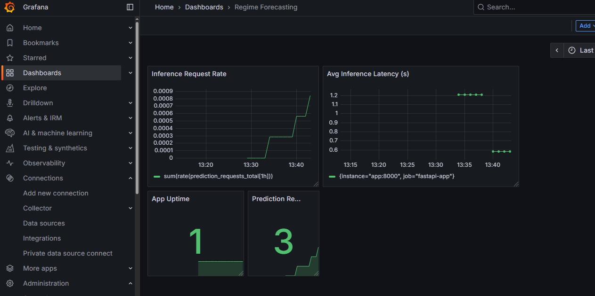

# Regime Forecasting: Clustering & Predicting Market Regimes with ML

This project identifies **market regimes** from historical S&P 500 returns and VIX volatility data using unsupervised clustering (KMeans), then builds a supervised forecasting model to predict the next day's regime based on engineered features like **MACD, moving averages, and lagged returns**.

The pipeline is production-grade, with:
- A **FastAPI app** for model inference
- A **Dash app** for exploring clusters and forecasts
- **Prometheus + Grafana Cloud** monitoring for observability
- Clean folder structure for scalability and future enhancements

---

## Project Summary

- **Clustering**: Use KMeans to define distinct market regimes from return and volatility characteristics.
- **Features**: Includes MACD, Bollinger Bands, moving averages, lagged returns, and more.
- **Forecasting**: Predict the next day's regime using features derived from technical indicators.
- **Model Selection**: Trained and hyperparameter-tuned three forecasting models using MLflow, selecting the best-performing model based on cross-validation metrics.
- **Serving**: FastAPI exposes a live inference endpoint.
- **Dash App**: Visualizes clustering results, feature trends, prediction confidence, and model evaluation metrics.
- **Monitoring**: Prometheus scrapes live metrics and Grafana Cloud visualizes model and system health.

---

## Live Demos

- **Render endpoint**: [https://regime-forecasting-1.onrender.com](https://regime-forecasting-1.onrender.com)
    - **FastAPI (inference)**: [https://regime-forecasting-1.onrender.com/docs](https://regime-forecasting-1.onrender.com/docs)
    - **Dash app (visualizations)**: [https://regime-forecasting-1.onrender.com/dash](https://regime-forecasting-1.onrender.com/dash)
    - **Prometheus (metrics)**: [https://regime-forecasting-1.onrender.com/metrics](https://regime-forecasting-1.onrender.com/metrics)

---

## Grafana Cloud Dashboard Preview

  
*Real-time monitoring of inference requests, latency, and prediction distribution.*

---

## Project Structure
regime_forecasting/
├── app/ # FastAPI model API with Prometheus metrics
│ ├── main.py
├── dash_app/ # Dash app for interactive regime visualizations
│ ├── app.py
│ ├── pages/cluster_plot.py # Clustering visuals and stats
│ └── pages/prediction_page.py # Inference and forecasting performance
├── inference/ # Model loading and prediction logic
│ └── predictor.py
├── notebooks/ # EDA, clustering, forecasting experiments
├── final_model/ # Saved model
├── data/ 
│ └── raw/close_prices.csv # Input data (S&P prices & VIX)
├── artifacts/ # intermediate files for pipeline stages
│ ├── clustering/
│ ├── data_ingestion/
│ ├── feature_engineering/
│ └── regime_model_forecasting/
├── src/ # Codebase to execute data pipline, clustering, ML forecasting HPO, and evaluation
├── requirements.txt
└── docker-compose.yml # Start Prometheus & Grafana stack

## Running The ML Training Pipeline Locally
```powershell
# (Optional) create and activate a virtual environment
python -m venv venv
venv\Source\activate

# Install dependencies
pip install -r requirements.txt

# Run the pipeline
python main.py
```

## Running the FastAPI Locally
```powershell
# Build docker images
docker-compose build --no-cache
docker-compose up -d # create and run containers (detached)

# Visit the following
http://localhost:8000/docs # Swagger UI (from FastAPI)
http://localhost:8000/predict # FastAPI for inference
http://localhost:8000/dash # Dash app
http://localhost:9090 # Prometheus metrics
http://localhost:3000 # Grafana dashboard

# To remove stop and remove Docker containers (and volumes)
docker-compose down -v
```

Note you will need to build out a prometheus.yml file like the below to connect to a Grafana Cloud dashboard stack:

```python
# prometheus.yml
global:
  scrape_interval: 15s

scrape_configs:
  - job_name: "fastapi-app"
    static_configs:
      - targets: ["app:8000"]
    metrics_path: "/metrics"
    scrape_interval: 15s
    scrape_timeout: 10s
    honor_labels: true

remote_write:
- url: <endpoint_url_from_Grafana_cloud>
  basic_auth:
    username: <username_from_Grafana_cloud>
    password: <apik_key_from_Grafana_cloud>
```